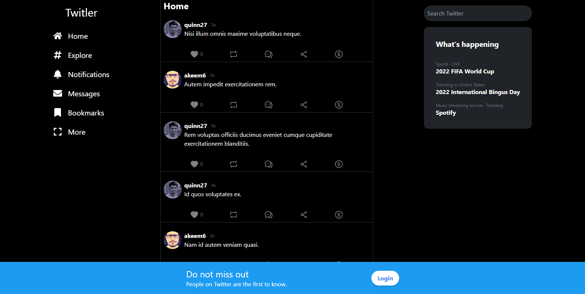
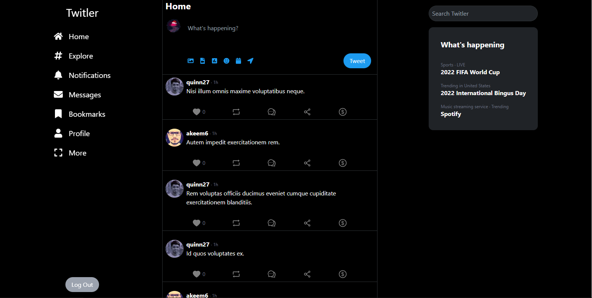
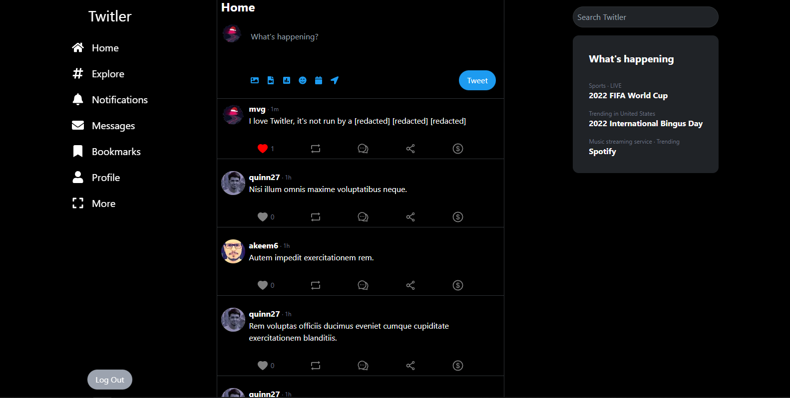
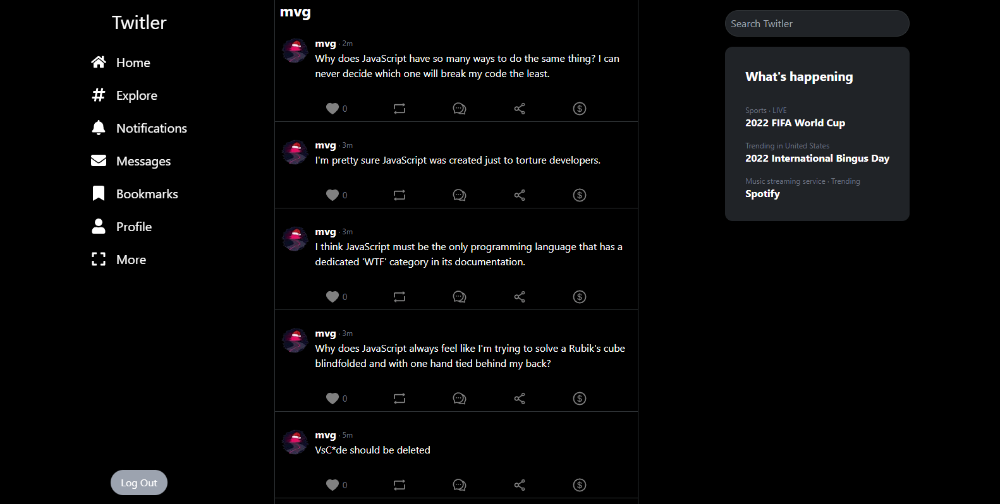

# Twitler

- [Twitler](#twitler)
  - [Quickstart](#quickstart)
  - [Code Points of Interest](#code-points-of-interest)
    - [Infinite Scroll](#infinite-scroll)
    - [Updating the QueryClient's cache](#updating-the-queryclients-cache)
  - [TODO](#todo)

---

A Twitter clone written with the [T3 Stack](https://create.t3.gg/).

No account view

Logged in

Created a tweet

Tweets from a specific user


Twitler, our new social media platform is designed to be fast, reliable, and easy to use. By leveraging the power of TypeScript, we are able to provide a robust and scalable codebase that is easy to maintain and improve upon.

We use Prisma to manage our database and ensure that all data is typesafe between the server and our database. This allows us to offer a rich set of features and functionality, while still maintaining excellent performance.

Our platform is built using TRPC, a modern, open-source remote procedure call (RPC) framework that allows for seamless communication between our server and client-side applications. This allows for a seamless and smooth user experience.

Finally, by running our platform on serverless infrastructure, we are able to offer a highly available and cost-effective solution. This means that our users can always count on our platform to be up and running, no matter how much traffic we receive.

Overall, Twitler is the perfect solution for users looking for a cutting-edge social media experience.

<details>
<summary>shh</summary>
The above was written by ChatGPT.
</details>

## Quickstart

```bash
pnpm install

pnpx prisma db push
pnpx primsa db seed

pnpm dev
```

## Code Points of Interest

### Infinite Scroll

[Infinite scroll](https://en.wikipedia.org/wiki/Infinite_scroll) is a common pattern in modern web apps. It's a way to load more data as the user scrolls down the page. It's a great way to keep users engaged and to reduce the number of clicks required to get to the content they want.

Create an infinite query from trpc. Use the [cursor](https://www.prisma.io/docs/concepts/components/prisma-client/pagination) feature of prisma to keep track of where the next tweets should be selected from.

[src/server/trpc/router/tweet.ts](src/server/trpc/router/tweet.ts)

```ts
export const tweetRouter = router({
  // ...
  timeline: publicProcedure
    .input(
      z.object({
        where: z
          .object({
            author: z.object({ name: z.string().optional() }).optional(),
          })
          .optional(),
        cursor: z.string().optional(),
        limit: z.number().min(1).max(100).default(10),
      })
    )
    .query(async ({ ctx, input }) => {
      const userId = ctx.session?.user?.id;
      const { where, limit, cursor } = input;
      const tweets = await ctx.prisma.tweet.findMany({
        where,
        take: limit + 1, // for cursor calculation
        orderBy: [{ createdAt: "desc" }],
        include: {
          author: { select: { image: true, name: true, id: true } },
          likes: { where: { userId }, select: { id: true } },
          _count: { select: { likes: true } },
        },
        cursor: cursor ? { id: cursor } : undefined,
      });
      let nextCursor: typeof cursor | undefined = undefined;
      if (tweets.length > input.limit) {
        const nextItem = tweets.pop() as typeof tweets[number];
        nextCursor = nextItem.id;
      }
      return { tweets, nextCursor };
    }),
  // ...
});
```

Use the `useInfiniteQuery` hook from trpc to fetch the data. The `getNextPageParam` option is used to tell trpc how to calculate the next cursor.

[src/components/Timeline.tsx](src/components/Timeline.tsx)

```tsx
const { data, hasNextPage, fetchNextPage, isFetching } =
  trpc.tweet.timeline.useInfiniteQuery(
    { limit: FETCH_LIMIT, where },
    { getNextPageParam: (lastPage) => lastPage.nextCursor }
  );
```

Use the `useEffect` hook to fetch the next page when the user scrolls near the bottom of the page.

[src/components/Timeline.tsx](src/components/Timeline.tsx)

```tsx
useEffect(() => {
  if (scrollPosition > 90 && hasNextPage && !isFetching) {
    fetchNextPage();
  }
}, [scrollPosition, fetchNextPage, hasNextPage, isFetching]);
```

### Updating the QueryClient's cache

The queryClient from react-query is used to cache the results of queries. This allows for the data to be available immediately when the user navigates to a page that uses the same query. It also allows for the data to be available immediately when the user navigates back to a page that uses the same query.

We need to match the query key exactly, so there are a lot of extra arguments to `updateCache`.

[src/components/Timeline.tsx](src/components/Timeline.tsx)

```tsx
/** Updates trpc's queryClient cache with new data.
 *
 * We need to match the query key exactly, so there are a lot of extra arguments.
 * @param queryClient trpc's queryClient
 * @param variables variables for the mutation
 * @param data the data to add if the user likes a tweet
 * @param input the input for the query
 * @param action the action that was performed
 */
const updateCache = ({
  queryClient,
  variables,
  data,
  input,
  action,
}: {
  queryClient: QueryClient;
  variables: { tweetId: string };
  data: { userId: string };
  input: RouterInputs["tweet"]["timeline"];
  action: "like" | "unlike";
}) => {
  queryClient.setQueryData(
    [["tweet", "timeline"], { input, type: "infinite" }],
    (oldData) => {
      const newData = oldData as InfiniteData<
        RouterOutputs["tweet"]["timeline"]
      >;
      const value = action === "like" ? 1 : -1;
      const newTweets = newData.pages.map((page) => {
        return {
          tweets: page.tweets.map((tweet) => {
            if (tweet.id === variables.tweetId) {
              return {
                ...tweet,
                likes: action === "like" ? [{ id: data.userId }] : [],
                _count: { likes: tweet._count.likes + value },
              };
            }
            return tweet;
          }),
        };
      });
      return { ...newData, pages: newTweets };
    }
  );
};
```

## TODO

- [ ] implement the rest of the nav pages (only home and profile work)
- [ ] optimistic updates for when a user creates a tweet
- [ ] retweeting
- [ ] replying
- [ ] fix css (it's a mess)
